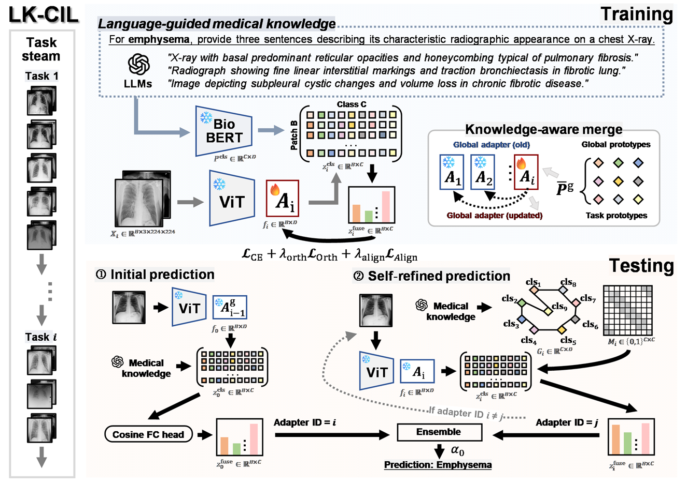

# LK-CIL: Language-guided Knowledge-enhanced Class-Incremental Learning for Chest X-ray Imaging

**Status:** Under Review


## Authors

Lingling Yuan, Kang Fu, Xiangwen Kong, Yan Han, Hongzan Sun, Xiaoyan Li, Marcin Grzegorzek, Chen Li


## Abstract

Chest-X-ray (CXR) class-incremental learning is prone to catastrophic forgetting owing to the sequential arrival of new disease categories and the scarcity of labelled images per class. We present a **Language-guided Knowledge-enhanced Class-Incremental Learning (LK-CIL)** framework that couples large-scale visual pre-training with structured clinical language priors to combat forgetting while adding minimal trainable parameters. 

1. **Language-guided knowledge merge (LKM):** standardised radiographic descriptions, generated by a large language model and encoded by BioBERT, are injected into a frozen ViT-B/16 backbone via lightweight adapter layers, aligning visual tokens with diagnostic semantics.   
2. **Graph-guided prototype refinement (GPR):** a sparse class-relation graph and a two-layer Graph Convolutional Network iteratively refine language-visual prototypes, and an ensemble of refined and original logits lowers forgetting. 
3. **Parameter-efficient design:** only the adapters and classifier head (~0.6 M parameters) are trainable, avoiding full-model retraining while achieving state-of-the-art performance. 

Extensive experiments on ChestX-ray14 (5-3 & 6-4 splits, long-tailed and balanced) and on the CCH5000 colorectal pathology dataset (2-2 split) show that LK-CIL delivers the highest AUC (up to 77.57 %) with the lowest forgetting (as low as 1.17 %) versus eight strong baselines.   


<div align="center">
  <!-- 设为 900 px 左右，一般栏宽约 1000 px，可近似占 80% -->
  
</div>


## Environment Setup

This project was developed with **Python 3.9.21** and **PyTorch 1.13.1 + CUDA 11.7**; experiments were run on an NVIDIA Quadro RTX 4000.

```bash
conda create --name lk_cil python=3.9.21 -y
conda activate lk_cil
pip install torch==1.13.1+cu117 torchvision==0.14.1+cu117 --extra-index-url https://download.pytorch.org/whl/cu117
pip install -r requirements.txt
 ```

## How to Run the Code  

The pipeline has two main stages: **(i) caching language features** and **(ii) incremental training / evaluation**.  
Below we list one-line commands for each stage; adjust paths and split names as needed.

1. **Cache text features:** 

```bash
python build_text_cache.py --prompt_json data/CXR14/prompts.json --out data/CXR14/text_feats.npy
```

2. **Train and evaluate:** 

```bash
python main.py  --config lkcil_cxr14.json
```


## Dataset  

This study evaluates incremental learning on two publicly available datasets: **ChestX-ray14** for chest-radiograph classification and **CCH5000** for colorectal histology analysis.

1. **ChestX-ray14 dataset:**  ChestX-ray14 is available from <https://nihcc.app.box.com/v/ChestXray-NIHCC>.
 
The recommended directory layout is:

```text
ChestXray14/
├─ images/
│  ├─ train/
│  │  ├─ 0_Atelectasis/
│  │  ├─ 1_Cardiomegaly/
│  │  ├─ 2_Effusion/
│  │  └─ ...
│  └─ test/            # same class folders as /train
├─ prompts/            # prompt templates for 14 classes
├─ text_feats.npy      # cached text embeddings
└─ text_feats_keys     # index mapping for text_feats.npy
 ``` 

2. **CCH5000 dataset:**  CCH5000 comprises 5000 colorectal tissue images spanning eight histological classes and can be downloaded from <https://zenodo.org/record/53169>.
We adopt the same hierarchical structure as the ChestX-ray14 dataset and provide corresponding prompts and text_feats.npy files.
